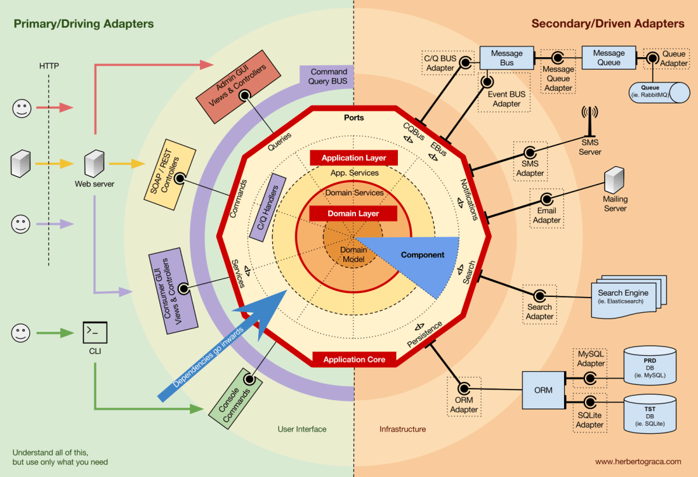

# Clean Architecture: Практическое применение современных принципов разработки

Данный проект - это практическое воплощение передовых концепций разработки программного обеспечения.  
Этот репозиторий служит наглядным примером применения таких фундаментальных принципов, как **Clean Architecture**, **SOLID**, **Domain-Driven Design (DDD)**, **KISS** и другие.  
Цель данного проекта - предоставить разработчикам всесторонний пример того, как эти абстрактные концепции могут быть эффективно реализованы в реальном проекте.

---
## Погружение в проект

### 1. Быстрый старт

1. [Обзор технологического стека](#исчерпывающий-стек-технологий): Ознакомьтесь с полным набором используемых технологий.
2. [Пошаговое руководство по развертыванию](#пошаговое-руководство-по-развертыванию): Детальные инструкции по запуску проекта.
3. [Карта доступных ресурсов](#карта-доступных-ресурсов-проекта): Навигация по всем endpoint'ам и интерфейсам проекта.

### 2. Глубокое погружение в архитектуру и документацию

1. [Архитектурный обзор](#архитектурный-обзор): Краткое введение в гексагональную архитектуру проекта.
2. [Расширенная документация по архитектуре](components/backend/README.md#архитектура): Подробное описание архитектурных решений.
3. [Визуализация Domain слоя](docs/uml_diagrams/images/entities.png): UML-диаграмма, иллюстрирующая ключевые сущности.
4. [Схема базы данных](docs/uml_diagrams/images/db_schema.png): Детальное представление структуры базы данных.
5. [Компонентная схема](docs/uml_diagrams/images/components.png): Визуальное отображение взаимосвязей между компонентами системы.

### 3. Структура и организация проекта

- [Философия оформления проекта](#философия-оформления-проекта): Подход к структурированию кодовой базы.

### 4. Процессы разработки и развертывания
Информация для разработчиков и DevOps-специалистов:

- [Непрерывная интеграция и доставка (CI/CD)](./deployment): Описание пайплайна данного проекта для автоматизации процессов.
- [Инструментарий разработчика](#пошаговое-руководство-по-развертыванию): Команды и скрипты для локальной разработки.
- [Производственное развертывание](#пошаговое-руководство-по-развертыванию): Процедуры и команды для запуска в продакшн-среде.

## Исчерпывающий стек технологий
Данный проект использует широкий спектр современных технологий:


Каждая из этих технологий была тщательно выбрана для обеспечения оптимальной производительности, масштабируемости и удобства разработки.

[К навигации по проекту](#погружение-в-проект)

---
## Архитектурный обзор
В основе данного проекта лежит гексагональная архитектура, также известная как "Ports and Adapters".
Эта архитектурная модель обеспечивает четкое разделение между бизнес-логикой приложения и внешними системами, что способствует созданию гибкого, легко тестируемого и расширяемого кода.



Гексагональная архитектура позволяет изолировать ядро приложения от внешних зависимостей, облегчая процесс тестирования и изменения отдельных компонентов без влияния на всю систему.

[К навигации по проекту](#погружение-в-проект)

---
## Пошаговое руководство по развертыванию
Для запуска проекта следуйте этим шагам:

1. Начните с создания файла конфигурации окружения:
   - Скопируйте файл [`components/backend/.env.example`](components/backend/.env.example) в `components/backend/.env`
   - Отредактируйте `.env`, установив необходимые значения для вашей среды

2. Перейдите в директорию с инструментами управления:
   ```
   cd deployment/backend/
   ```

3. Запустите проект, используя соответствующий скрипт:
   - Для продакшн среды:
     ```
     bash ./manage/start.sh
     ```
   - Для среды разработки:
     ```
     bash ./manage/start.sh --dev
     ```

Эти команды инициируют процесс сборки и запуска всех необходимых сервисов в Docker-контейнерах.

Для полного контроля над жизненным циклом приложения ознакомьтесь с [полным списком команд управления](./deployment/backend/manage/README.md), включающим инструкции по остановке, перезапуску и удалению компонентов проекта.

[К навигации по проекту](#погружение-в-проект)

---
## Карта доступных ресурсов проекта
После успешного развертывания вам будут доступны следующие ресурсы:

#### При запуске **production** mode
- **API**: 
  - Основной интерфейс для взаимодействия с бэкендом
  - URL: http://0.0.0.0:8080/api/v1

- **WebSocket для уведомлений**: 
  - Обеспечивает реал-тайм коммуникацию
  - URL: http://0.0.0.0:8080/api/v1/

#### При запуске **development** mode
- **API**: 
  - Основной интерфейс для взаимодействия с бэкендом
  - Через nginx: http://0.0.0.0:8080/api/v1
  - Напрямую: http://0.0.0.0:9000/api/v1
- **WebSocket для уведомлений**: 
  - Обеспечивает реал-тайм уведомления
  - Через nginx: http://0.0.0.0:8080/api/v1/
  - Напрямую: http://0.0.0.0:9000/api/v1/
- **Swagger UI**: 
  - Интерактивная документация API (доступно только в среде разработки)
  - Через nginx: http://0.0.0.0:8080/apidoc/swagger
  - Напрямую: http://0.0.0.0:9000/apidoc/swagger
- **Redoc UI**:
  - Альтернативная интерактивная документация API с другим интерфейсом
  - Через nginx: http://0.0.0.0:8080/apidoc/redoc
  - Напрямую: http://0.0.0.0:9000/apidoc/redoc
- **PgAdmin**: 
  - Веб-интерфейс для управления базой данных PostgreSQL
  - Через nginx: http://0.0.0.0:8080/pgadmin4/
  - Напрямую: http://0.0.0.0:5050/
- **Web RabbitMQ**:
  - Веб-интерфейс для мониторинга и управления RabbitMQ (сообщениями и очередями)
  - Напрямую: http://0.0.0.0:15672/

**!!! ОСТОРОЖНО !!!** - Не забывайте, если Вы изменили порты в `components/backend/.env` файле со стандартных, то не забудьте обновить URL ресурсов.

[К навигации по проекту](#погружение-в-проект)

---
## Философия оформления проекта
Текущий проект следует концепции монорепозитория, что позволяет централизованно управлять всеми компонентами системы.

Ключевые аспекты организации проекта:
- Корневая директория содержит общие конфигурационные файлы, такие как [`.gitignore`](.gitignore) и [`.editorconfig`](.editorconfig).
- Директория [deployment](./deployment) включает все необходимое для CI/CD процессов.
- В [docs](./docs) хранится техническая документация, включая UML-диаграммы.
- Директория [components](./components) разделяет фронтенд и бэкенд части проекта (_конечно фронтенд части пока нет, и не факт что появится, сорямба_).
- Бэкенд расположен в [backend](./components/backend) и структурирован как стандартный **Python-пакет**.
- Для управления зависимостями и виртуальным окружением используется [Poetry](https://python-poetry.org/), что отражено в `pyproject.toml`.

Такая структура обеспечивает четкое разделение компонентов, облегчает навигацию по проекту и способствует эффективному управлению кодовой базой.

[К навигации по проекту](#погружение-в-проект)

_Я буду рад, если этот проект послужит вам полезным ресурсом для изучения и применения принципов чистой архитектуры и современных практик разработки.  
Если у вас возникнут вопросы или предложения, не стесняйтесь обращаться ко мне через issues, pull requests или почту, по мере сил и возможностей буду стараться отвечать.  
Удачи в изучении и разработке 😉_