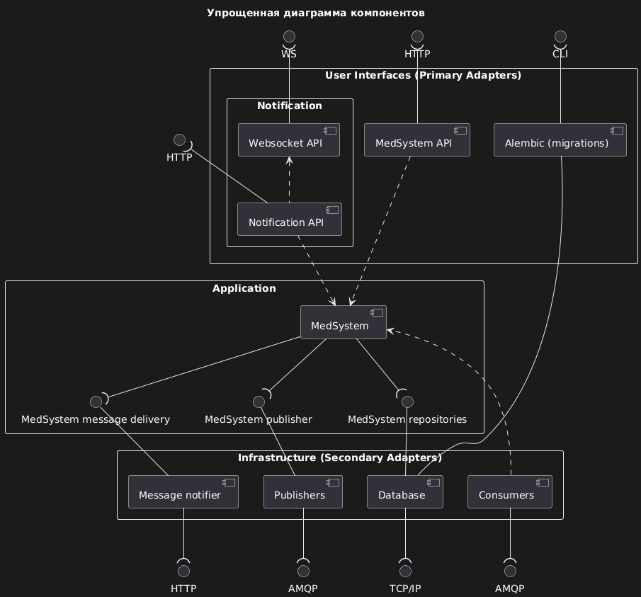

# Backend

---
## Навигация по backend
- [Архитектура backend](#архитектура)
- [Слой Application](#слой-application)
- [Слой Adapters](#слой-adapters)
- [Слой Launchers](#слой-launchers)
- [Навигация по проекту](../../README.md#погружение-в-проект)

---
## Архитектура
#### Для текущего проекта "Гексагональная" архитектура использована в адаптированном варианте.
- Например, **Domain слой** представлен только одним python модулем - 
[entities.py](./med_sharing_system/application/entities.py)
- **Primary** и **Secondary** адаптеры объединены в один слой.

[К навигации](#навигация-по-backend)

---
## [Слой Application](./med_sharing_system/application)

Слой Application содержит ключевую бизнес-логику проекта и включает следующие компоненты:
Этот слой не зависит от конкретных реализаций адаптеров, используя механизм Dependency Injection (DI).
Валидация данных происходит при вызове публичных методов сервисов, используя Pydantic модели.
Цель слоя Application - изолировать бизнес-логику от внешних зависимостей, обеспечивая гибкость, тестируемость и масштабируемость системы.
Простые структуры данных (словари, списки) не должны передаваться между слоями напрямую.

[Подробное описание слоя Application](./med_sharing_system/application/README.md#application)

### Минимальный свод правил
1. **Сущности и DTO:**
   - При сложной предметной области создаются сущности (domain слой), описывающие поведение и бизнес-правила.
   - При простой предметной области используются DTO (датаклассы с базовым поведением).
   - Запрещена передача простых структур данных (словари, списки) между слоями напрямую.
2. **Сервисы (Use Cases):**
   - Реализуют основную бизнес-логику, оркеструя взаимодействие между сущностями и внешними системами.
   - Используют Dependency Injection для внедрения адаптеров инфраструктурного слоя через интерфейсы.
   - Валидация входных данных происходит при вызове публичных методов, используя Pydantic модели.
   - Допускается вызов других сервисов, но в разумных пределах.
3. **Интерфейсы:**
   - Определяют контракты для взаимодействия с внешними системами и инфраструктурой.
   - Обеспечивают абстракцию и независимость бизнес-логики от конкретных реализаций.
4. **Обработка ошибок:**
   - Централизованное определение и управление ошибками приложения.
   - Создание иерархии исключений, специфичных для бизнес-логики.
5. **Константы и модели данных:**
   - Определение всех констант и структур данных, используемых в бизнес-логике.
   - Обеспечение единого источника истины для важных значений и типов данных.
6. **Независимость от инфраструктуры:**
   - Слой не должен зависеть от конкретных реализаций баз данных, фреймворков или внешних сервисов.
   - Все взаимодействия с внешними системами осуществляются через абстракции (интерфейсы).
7. **Тестируемость:**
   - Дизайн компонентов должен обеспечивать легкость модульного тестирования.
   - Использование моков и стабов для имитации внешних зависимостей в тестах.
8. **Чистота и изоляция:**
   - Бизнес-логика должна быть изолирована от деталей реализации инфраструктуры и пользовательского интерфейса.
   - Избегание использования фреймворк-специфичных аннотаций или классов в core бизнес-логике.
9. **Документация:**
   - Четкое документирование публичных API сервисов и их контрактов.
   - Описание бизнес-правил и ограничений в комментариях к коду или отдельной документации.
10. **Масштабируемость и расширяемость:**
    - Проектирование компонентов с учетом возможности будущих расширений.
    - Использование принципов SOLID для обеспечения гибкости и поддерживаемости кода.

[К навигации](#навигация-по-backend)

---
## [Слой Adapters](./med_sharing_system/adapters)

Слой Adapters в гексагональной архитектуре обеспечивает взаимодействие между ядром приложения и внешним миром.
Он изолирует бизнес-логику от внешних зависимостей, повышая гибкость и устойчивость системы к изменениям.
Адаптеры преобразуют данные между форматами, понятными внешним системам и внутренней логике приложения.

[Подробное описание слоя Adapters](./med_sharing_system/adapters/README.md#adapters)

### Минимальный свод правил

1. **Изоляция ядра**: Адаптеры должны защищать внутреннюю логику от деталей внешних систем.
2. **Реализация портов**: Адаптеры реализуют интерфейсы, определенные в слое приложения.
3. **Преобразование данных**: Обеспечивать трансформацию данных между внешними и внутренними форматами.
4. **Управление зависимостями**: Сосредоточить работу с внешними библиотеками и фреймворками в этом слое.
5. **Обработка запросов**: Отвечать за прием входящих запросов и их маршрутизацию к соответствующим use cases.
6. **Инфраструктурное управление**: Управлять взаимодействием с базами данных, API и другими внешними системами.
7. **Независимость компонентов**: Разные адаптеры (веб, база данных, внешние сервисы) должны быть независимы друг от друга.
8. **Тестируемость**: Проектировать адаптеры с учетом возможности их легкого мокирования для модульных тестов.
9. **Минимизация логики**: Адаптеры должны содержать минимум бизнес-логики, фокусируясь на преобразовании и передаче данных.
10. **Гибкость замены**: Обеспечить возможность легкой замены одного адаптера другим без изменения ядра приложения.

[К навигации](#навигация-по-backend)

---
## [Слой Launchers](./med_sharing_system/launchers)

Слой Launchers в гексагональной архитектуре отвечает за инициализацию и запуск приложения.
Он служит точкой входа, обеспечивая сборку, конфигурацию и правильное взаимодействие всех компонентов системы.
Этот слой играет ключевую роль в управлении жизненным циклом приложения.

[Подробное описание слоя Launchers](./med_sharing_system/launchers/README.md#launchers)

### Минимальный свод правил

1. **Централизация инициализации**: Все аспекты запуска и конфигурации должны быть сосредоточены в этом слое.
2. **Управление зависимостями**: Обеспечивать правильное внедрение и связывание зависимостей между компонентами.
3. **Конфигурация окружения**: Поддерживать гибкую конфигурацию для различных сред выполнения (разработка, тестирование, продакшн).
4. **Порядок инициализации**: Соблюдать правильную последовательность запуска компонентов системы.
5. **Изоляция от бизнес-логики**: Не включать бизнес-логику в этот слой, фокусируясь только на запуске и конфигурации.
6. **Управление жизненным циклом**: Контролировать корректный запуск и завершение работы приложения.
7. **Поддержка различных сценариев**: Обеспечивать возможность запуска различных частей приложения (веб-сервер, фоновые задачи, миграции).
8. **Минимизация сложности**: Стремиться к простоте и читаемости кода, избегая создания "божественных объектов".
9. **Гибкость конфигурации**: Использовать внешние источники для конфигурации (файлы, переменные окружения).
10. **Тестируемость**: Проектировать компоненты так, чтобы их можно было легко заменить или изолировать для тестирования.

[К навигации](#навигация-по-backend)
