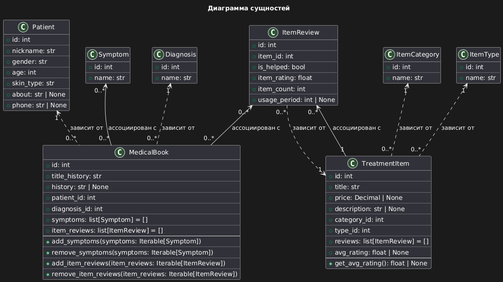

# Application
**Данный слой хранит в себе бизнес-логику проекта.**  
И по сути держится на двух столпах - это [**СУЩНОСТИ**](#entities) и [**СЦЕНАРИИ ИСПОЛЬЗОВАНИЯ**](#services-или-use-cases)

### Как понять что является бизнес-логикой?
**Идеальный сценарий**: 
Бизнес-логика может быть описана/оцифрована с помощью абстракций (сущностей) и не привязана к конкретным техническим зависимостям.

**Реальный сценарий**: 
В некоторых проектах ядро может опираться на конкретную зависимость, без которой невозможно описать бизнес-процессы. Например, проекты, использующие библиотеку [**pandas**](https://pandas.pydata.org/docs/), могут включать её в слой **application** или даже в **domain слой**, если вся логика строится вокруг работы с `DataFrame`.

### Зачем при разработке бизнес-логики стремятся к максимальной изоляции?
Бизнес-логика должна описывать/оцифровывать процессы бизнеса. В идеале она не должна зависеть от инфраструктуры или какой-либо другой внешней среды, чтобы оставаться устойчивой к изменениям и легко тестироваться.

### Почему стремятся к максимальной изоляции при оцифровке бизнес-логики?
1. **Независимость от инфраструктуры**: **Application** слой должен быть независимым от внешних факторов, таких как база данных, фреймворки или пользовательский интерфейс.
При возникновении "черных лебедей" (санкции, апокалипсис) гораздо легче произвести замену, по сравнению с системой, в которой высокая связанность компонентов.  
2. **Чистота бизнес-логики**: Изоляция позволяет сосредоточиться на описании бизнес-процессов без учета технических деталей реализации.
3. **Упрощение тестирования**: Изолированные **domain** и **application** слои легче покрыть модульными тестами.
4. **Гибкость и масштабируемость**: Изолированную бизнес-логику проще изменять и расширять без влияния на другие части системы.
5. **Повторное использование**: Хорошо изолированные **domain** и **application** слои можно использовать в разных проектах или контекстах.

### Почему избегают изоляции бизнес-логики?
1. **Дополнительные абстракции**: Требуется создавать дополнительные абстракции, что усложняет код.
2. **Время на разработку**: Правильное проектирование изолированного **domain** слоя может занять больше времени на начальных этапах.
3. **Сложность в интеграции**: Могут возникать трудности при интеграции изолированного **domain** слоя с внешними зависимостями.

---
## [Entities](./entities.py)
Это часть **Domain** слоя гексагональной архитектуры. В случае объемной бизнес-логики этот слой, как правило, выносится в отдельную директорию `domain`. В данном проекте бизнес-логика есть, но не столь объемная, поэтому она умещается в одном модуле [entities.py](./entities.py).

### Что такое сущность?

**Сущность** - это фундаментальный элемент бизнес-логики в чистом виде. Это объект, который представляет ключевые концепции и правила предметной области.

### Ключевые характеристики сущностей:

1. **Бизнес-данные и правила**: Сущность объединяет в себе данные и правила, относящиеся к конкретному бизнес-объекту.
2. **Независимость**: Сущность обособлена от деталей реализации и самостоятельна. Она не зависит от способа хранения данных или внешних систем.
3. **Идентичность**: Каждая сущность имеет уникальную идентичность, которая остается неизменной на протяжении всего жизненного цикла объекта.
4. **Инкапсуляция бизнес-правил**: Сущность содержит критические бизнес-правила в себе или имеет прямой доступ к ним.
5. **Неизменность**: Многие сущности проектируются как неизменяемые объекты, что повышает их надежность и предсказуемость.

### Отличия сущностей от Services (Use Cases):
1. **Уровень абстракции**: Сущности представляют базовые концепции домена, в то время как Use Cases описывают конкретные сценарии использования этих концепций.
2. **Область ответственности**: Сущности отвечают за правила и состояния отдельных бизнес-объектов, а Use Cases координируют взаимодействие между различными сущностями и внешними системами.
3. **Зависимости**: Сущности не должны зависеть от внешних систем или инфраструктуры, тогда как Use Cases могут взаимодействовать с различными слоями приложения.
4. **Жизненный цикл**: Сущности обычно имеют длительный жизненный цикл и могут существовать в разных контекстах, а Use Cases обычно представляют конкретные операции или процессы.
5. **Изменчивость**: Сущности редко меняются, так как они представляют стабильные концепции домена. Use Cases могут меняться чаще в ответ на изменения требований пользователей.

### Примеры сущностей:
- В банковской системе: `Account`, `Transaction`, `Customer`
- В системе электронной коммерции: `Product`, `Order`, `User`
- В системе управления проектами: `Project`, `Task`, `Employee`

### Сущности данного проекта представлены на следующей диаграмме

---
## [Services или Use Cases](./services)

### Определение и назначение
**Services** оперируют сущностями и предоставляют интерфейсы для взаимодействия с инфраструктурой.
Их основное назначение - оркестрация бизнес-логики в виде реализации сценариев бизнес-логики.
Как правило, Services включают в себя все оцифрованные бизнес-процессы.

### Ключевые характеристики
1. **Оркестрация бизнес-логики**: **Services** координируют работу различных компонентов domain слоя для выполнения конкретных бизнес-операций.
2. **Независимость от инфраструктуры**: Хотя **services** знают о существовании инфраструктуры, они не должны зависеть от конкретных реализаций.
3. **Использование абстракций**: **Services** работают с абстракциями (интерфейсами) для взаимодействия с внешними системами, что обеспечивает гибкость и тестируемость.
4. **Транзакционное управление**: **Services** часто отвечают за управление транзакциями, особенно когда операция затрагивает несколько сущностей или репозиториев.

### Роль в архитектуре
1. **Связующее звено**: **Services** соединяют инфраструктуру (контроллеры, базы данных) с domain слоем, обеспечивая чистоту бизнес-логики.
2. **Контекст выполнения**: Определяют, какие бизнес-правила должны быть применены в каждом конкретном сценарии.
3. **Управление потоком данных**: Отвечают за получение данных из внешних источников, их обработку и передачу результатов обратно.
4. **Абстракция сложности**: Скрывают сложность взаимодействия различных компонентов системы от клиентского кода.

### Преимущества использования Services
1. **Разделение ответственности**: Позволяет изолировать бизнес-логику от деталей реализации инфраструктуры.
2. **Улучшение тестируемости**: **Services** легко тестировать, так как они работают с абстракциями.
3. **Гибкость и расширяемость**: Упрощает добавление новых функциональностей или изменение существующих без затрагивания core бизнес-логики.
4. **Повторное использование**: **Services** могут быть использованы в различных контекстах приложения.

### Примеры Use Cases:
1. В банковской системе:
   - `TransferFunds`: Перевод средств между счетами
   - `OpenNewAccount`: Открытие нового банковского счета
   - `GenerateAccountStatement`: Формирование выписки по счету
2. В системе электронной коммерции:
   - `PlaceOrder`: Размещение нового заказа
   - `ProcessRefund`: Обработка возврата товара
   - `UpdateProductInventory`: Обновление информации о наличии товара
3. В системе управления проектами:
   - `AssignTaskToEmployee`: Назначение задачи сотруднику
   - `GenerateProjectReport`: Создание отчета по проекту
   - `UpdateProjectStatus`: Обновление статуса проекта

Каждый из этих **Use Cases** будет взаимодействовать с одной или несколькими сущностями и, возможно, с внешними сервисами для выполнения конкретного сценария использования.

#### Примеры взаимодействия сущностей и Use Cases:
1. `TransferFunds`:
   - Взаимодействует с сущностями `Account` для проверки баланса и выполнения транзакции
   - Создает новую сущность `Transaction` для записи операции
   - Может взаимодействовать с внешним сервисом для проверки на мошенничество
2. `PlaceOrder`:
   - Проверяет сущность `Product` для подтверждения наличия товара
   - Создает новую сущность `Order`
   - Обновляет сущность `User` с информацией о новом заказе
   - Может взаимодействовать с платежной системой для обработки оплаты
3. `AssignTaskToEmployee`:
   - Проверяет сущности `Project` и `Task` для подтверждения существования задачи
   - Обновляет сущность `Employee`, добавляя новую задачу
   - Может отправлять уведомление через внешнюю систему оповещений

Эти примеры показывают, как **Use Cases** оркестрируют взаимодействие между различными сущностями и внешними системами для выполнения конкретных бизнес-операций, в то время как сами сущности содержат основные данные и правила предметной области.